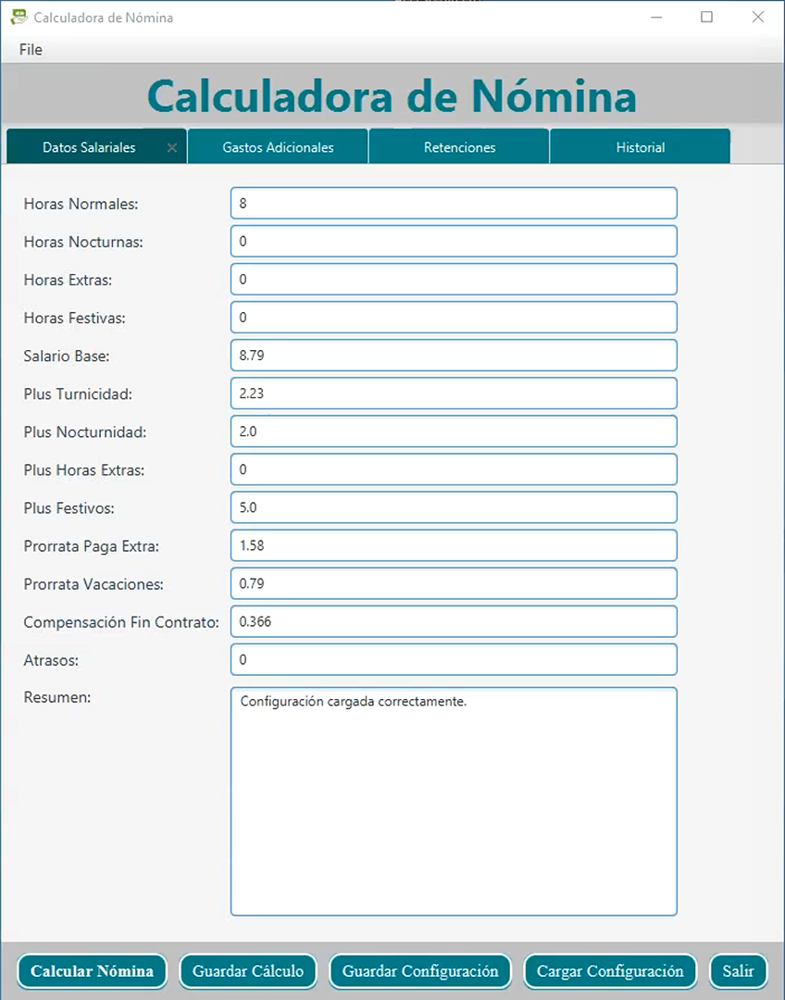
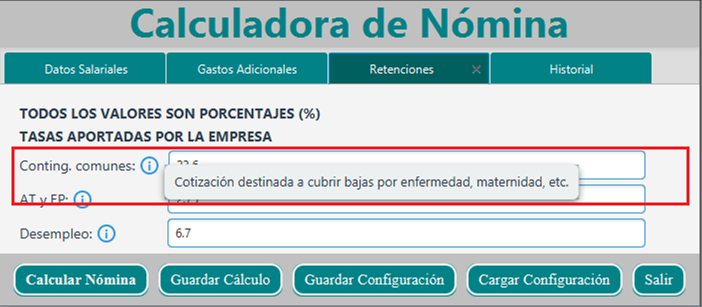
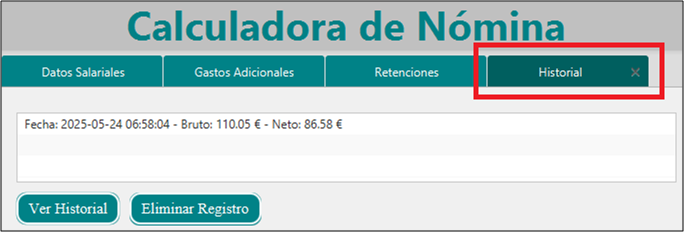

# 💼 Aplicación de Cálculo de Nóminas — JavaFX

Proyecto **formativo** desarrollado durante el Grado Superior en **Desarrollo de Aplicaciones Multiplataforma (DAM)**.

Se trata de una aplicación de escritorio para el **cálculo de nóminas y gestión básica de empleados**, desarrollada con **Java y JavaFX**, con persistencia de datos en base de datos relacional.

---

## 🎯 Objetivo del proyecto

El objetivo principal de este proyecto es aplicar los conocimientos adquiridos durante la formación, especialmente:

- Programación orientada a objetos en Java
- Uso de **JavaFX** para interfaces gráficas
- Acceso a datos mediante **JDBC**
- Separación básica de responsabilidades
- Uso de bases de datos relacionales

---

## 🧱 Estructura del proyecto

El proyecto sigue una estructura organizada por capas funcionales, propia de un entorno formativo DAM:

- **a_main**: clase principal de arranque de la aplicación  
- **b_controllers**: controladores de la interfaz JavaFX  
- **c_view**: archivos FXML que definen las vistas de la aplicación  
- **d_basedatos**: gestión de la conexión y acceso a datos  
- **e_estilos**: estilos CSS aplicados a la interfaz  

Esta organización refleja el aprendizaje progresivo de separación de responsabilidades dentro de la aplicación.

---

## ☕ Requisitos

- **Java JDK 8**
- **JavaFX** (incluido en Java 8)

> Nota: El proyecto fue desarrollado y probado con **Java 8 (JRE 8u202)**.  
> Al intentar ejecutarlo con versiones posteriores de Java se detectaron problemas de compatibilidad con JavaFX, por lo que se recomienda utilizar Java 8 para su correcta ejecución.

---

## ▶️ Ejecución del proyecto

La aplicación puede ejecutarse a partir del archivo `.jar` generado.

### Pasos para ejecutar el `.jar`

1. Asegurarse de tener instalado **Java JDK 8** y correctamente configurado en el sistema.
2. Abrir una terminal en la carpeta `dist`.
3. Ejecutar el siguiente comando:

```bash
java -jar CalcuNominaFxml.jar
```

La aplicación se iniciará mostrando la interfaz gráfica desarrollada con JavaFX.

> El proyecto también puede ejecutarse directamente desde el IDE ejecutando la clase principal de la aplicación.

---

## 🛠️ Tecnologías utilizadas

- Java
- JavaFX
- JDBC
- SQL
- Base de datos relacional

---

## 📸 Capturas de la aplicación

### Datos salariales


### Retenciones


### Guardado y carga de configuración


### Registros


---

## 📌 Estado del proyecto

✔ Proyecto funcional  
📘 Proyecto formativo, no orientado a entorno de producción

---

## 👤 Autor

**Jairo Sánchez**  
Desarrollador Junior
